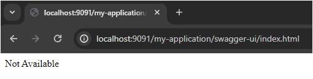

# spring-boot-basic-auth-security
Application to demonstrate Spring boot security using Basic Auth (Username and Password) as authentication type. 

This application covers the below functionalities:

1. <b>User Registration (API authentication is not required)</b>
   - New use registration without API authentication
2. <b>User Management (API authentication is required)</b>
   - Get all users
   - Delete a user
3. <b>Account Management (API authentication is required)</b>
    - Get all accounts
    - Get an account
    - Create new account
    - Update existing account
    - Delete existing account
4. <b>Transaction Management (API authentication is required)</b>
    - Deposit an amount to an account
    - Withdraw an amount from an account

### Project Technologies

- Java version: 17.0.8, vendor: Oracle Corporation
- Apache Maven 3.2.3
- Spring boot 3.1.5
- PostgreSql Database
- Spring boot JPA
- Spring security 6.1.5 (Implemented Basic Auth in this project)
- Lombok
- OpenApi 3 Specifications

### Database

PostgreSQL has been used in this project. Also, this project stores account's events in the form of JSON in JSONB column
in the application table.

JSON data types are for storing JSON (JavaScript Object Notation) data. Such data can also be stored as text, but the 
JSON data types have the advantage of enforcing that each stored value is valid according to the JSON rules. There are 
also assorted JSON-specific functions and operators available for data stored in these data types.

PostgreSQL offers two types for storing JSON data: 

- JSON 
- JSONB. 

1. JSON stores white space, and that is why we can see spaces when key "a" is stored, while JSONB does not.
2. JSON stores all the values of a key. This is the reason you can see multiple values (2 and 1) against the key "a", while JSONB only "stores" the last value.
3. JSON maintains the order in which elements are inserted, while JSONB maintains the "sorted" order.
4. JSONB objects are stored as a decompressed binary as opposed to "raw data" in JSON, where no reparsing of data is required during retrieval.
5. JSONB also supports indexing, which can be a significant advantage.

### OpenAPI Specification

- Path

http://localhost:8081/my-application/swagger-ui/index.html

- Swagger Authorization

- Swagger UI Details

### Disable OpenAPI Swagger for Production Environment

We can disable OpenAPI swagger for any environment based upon profiles. We can supply a VM argument 
'-Dspring.profiles.active=<environment name>' to the application configurations.
Using spring profile annotation @Profile("prod"), we can control the display of swagger.

- VM Argument

If the value of spring profile is 'prod', then swagger won't be available. Please refer the below screenshot:

### API Testing

- Postman Collection

- Database tables script

- Users created on load

- Create New User - Validation Error

- Create User - Password and MatchPassword Does not Match Validation Error

- Create User - Success - No Auth

- Create User - No Auth Shown Under Authorization tab of Postman

- Create User - New user created in database table 'user_table'

- Get User - Not Authorized without authentication

- Get Users - Successful with Basic Auth

- Create Account - Not Authorized without authentication

- Create Account - Successful with Basic Auth

- Get All Accounts - Not Authorized without authentication

- Get All Accounts - Successful with Basic Auth

- Get Account Details - Not Authorized without authentication

- Get All Accounts - Successful with Basic Auth

- Deposit Amount to an Account - Not Authorized without authentication

- Deposit Amount to an Account - Successful with Basic Auth

- Withdraw Amount from an Account - Not Authorized without authentication

- Withdraw Amount from an Account - Successful with Basic Auth

